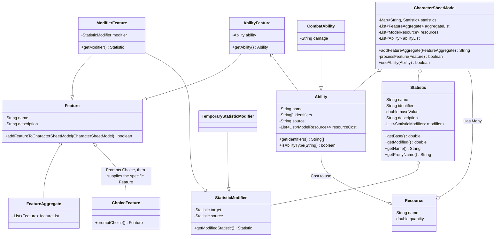

CombatAbility: Damage String format:  [n]d[b]...+[S1+...+Sx]
- n = number of dice of type [b]  
- b = base of dice rolled, e.g. d6, d20  
- Sx = arbitrary number of score modifier

```mermaid
classDiagram
    %% Can be used to represent how much of a resource the CharacterSheetModel has
    %% or can be used to represent the resource cost for an ability
    class Resource{
        -String name
        -double quantity
    }
    class Feature{
    -String name
    -String description
    +addFeatureToCharacterSheetModel(CharacterSheetModel) boolean
    }
    class ModifierFeature{
    -StatisticModifier modifier
    +getModifier() Statistic
    }
    class AbilityFeature{
    -Ability ability
    +getAbility() Ability
    }
    %% A single in-game Feature in turn provides several more in-game Features
    %% Or, a single in-game Feature applies multiple changes, which function mechanically as several Features here
    class FeatureAggregate{
        - List~Feature~ featureList
    }
    %% name - the UX friendly name of this statistic
    %% identifier - the "magic string" that refers to this statistic in String parsing
    %% globalConverter - This stat is used to influence the value of other stats; this rule generates the influencing value from the base number
    %% localConverter - This stat is influenced by the value of one or more other stats in an unusual way
    class Statistic{
        -String name
        -String identifier
        -double baseValue
        -String description
        -List~StatisticModifier~ modifiers
        +getBase() double
        +getModified() double
        +getName() String
        +getPrettyName() String
    }
    %% target - the Statistic whose value is modified
    %% source - the Statistic whose value is used to modify target 
    class StatisticModifier{
    -Statistic target
    -Statistic source
    +getModifiedStatistic() Statistic
    }
    class TemporaryStatisticModifier{
    }
    class CharacterSheetModel{
        -Map~String, Statistic~ statistics
        -List~FeatureAggregate~ aggregateList 
        -List~ModelResource~ resources
        -List~Ability~ abilityList
        +addFeatureAggregate(FeatureAggregate) String
        -processFeature(Feature) boolean
        +useAbility(Ability) boolean
    }

    class Ability{
        -String name
        -String[] identifiers
        -String source
        -List~List~ModelResource~~ resourceCost
        +getIdentifiers() String[]
        +isAbilityType(String) boolean
    }
    class CombatAbility{
        -String damage
    }

    class ChoiceFeature{
    +promptChoice() Feature
    }

    CombatAbility --|> Ability
    Feature o-- FeatureAggregate
    CharacterSheetModel o-- Ability
    Feature <|-- ChoiceFeature : Prompts Choice, then supplies the specific Feature
    CharacterSheetModel o-- Statistic
    ModifierFeature --|> Feature
    AbilityFeature --|> Feature
    AbilityFeature o-- Ability
    Statistic o-- StatisticModifier
    TemporaryStatisticModifier --|> StatisticModifier
    Ability --o Resource : Cost to use
    CharacterSheetModel --o Resource : Has Many
    ModifierFeature --o StatisticModifier
```